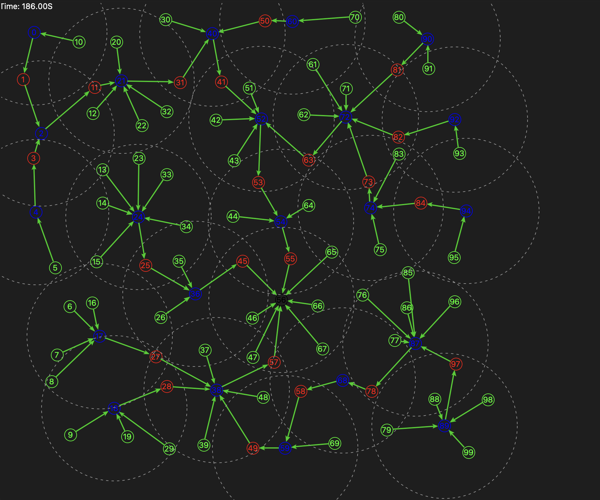

# WSN ForestNet
The vast majority of the code is located in wsnlab/source/sensor_node.py which contains the SensorNode class that implements the WSN. The confiuration file "wsnlab/source/config.py" allows modification of the network parameters and test various things.

# Featureset
- PROBE and HEARTBEAT packets to advertise capabilities and roles, populate negihbor tables and allows nodes to test if neighbors are alive.
- Hybrid routing protocol, n-hop mesh with AODV type (ROUTE REQ, ROUTE RESP) to discovery 2 hop neighbors. Note: that > 1 hop does not function correctly, I focused on getting tree routing working properly and using local mesh inbetween.
- Tree routing is functional, Cluster Heads learn routes via NETID_REQ and NETID_RESP packets and stores this info in child networks tables.
- Routers exist as bridges between pairs of Cluster Heads, witout the additional metadata and overhead of maintaining members and child networks tables. A Cluster Head will see if any of its members can be promoted to CH and if we can promote to a router. 
- Here is an example of a built network (image):



# Instructions to Run the Code
There are several options available to run the code, note the code was developed with Python 3.13.9 and a venv is probably necessary.
- "python wsnlab/main.py" which runs the standard simulation that does not test any features such as
    killing nodes, changing topology, etc. All logs will be saved in the "logs" folder. They contain table data and path data for all non heartbeat or probe packets sent.
- "python wsnlab/main_delete_node.py" deletes a configurable number of nodes at random and tests the ability for the network to heal and remap.


## Path Tracing, Table Logging, and Deliveries
All data is saved in csv files in the 'logs' folder after a simulation run and the windows is closed. After the sim runs the output will print info about delivery and battery usage like so:
```
done
wall time: 461.95s for sim duration=5000s (timescale=0.1,expected ~500.00s)
Final role counts: {'UNDISCOVERED': 0, 'UNREGISTERED': 0, 'ROOT': 1, 'REGISTERED': 55, 'CLUSTER_HEAD': 22, 'ROUTER': 22}
Node #53 [4631.41574] Packet (DATA) lost en route to Node #44
Node #41 [4640.61519] Packet (DATA) lost en route to Node #52
join time stats (100 nodes): min=0.0769, avg=12.3039, max=35.2559
packet deliveries logged: 232907
Min bat: 908.89 mAh (90.89%) - uid=52, addr=None
Max bat: 994.42 mAh (99.44%) - uid=99, addr=[13,2]
Avg bat: 979.76 mAh (97.98%)
```


#
